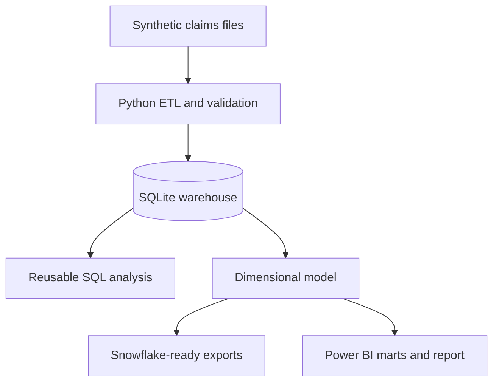

# Healthcare Claims Analytics

[](https://github.com/raghuvardhan-mutha/healthcare-claims-analytics/actions/workflows/ci.yml)
[](https://www.python.org/)
[](snowflake/README.md)


An end-to-end portfolio project that turns raw healthcare claims into validated data, reusable SQL analysis, and a five-page Power BI report. I built it around questions a claims analytics team regularly needs to answer: What is driving paid amount? Where are denials concentrated? Which providers differ from their peers? Which payment patterns deserve a closer review?

**Dataset:** 40,514 synthetic claims · 5,000 beneficiaries · 400 providers · 2021–2023  
**Tools:** SQL · Python · Power BI · SQLite · Snowflake-ready dimensional modeling · pytest · GitHub Actions

> This project uses synthetic data only. Payment-integrity indicators are prioritization signals, not findings of fraud, and the report is not intended for clinical decision-making.

## Executive summary

The project begins with generated claims files and ends with a tested analytical model and interactive report. Python handles generation, loading, validation, and exports. SQL contains the business logic. SQLite provides a fully reproducible local warehouse, while the Snowflake folder demonstrates how the dimensional model can be deployed in an enterprise environment. Power BI consumes six reporting marts produced by the same pipeline.

### What I built

- A normalized 14-table claims warehouse covering beneficiaries, providers, claims, diagnoses, procedures, pharmacy events, and adjudication
- More than 30 reusable SQL analyses for claims operations, finance, provider performance, utilization, and payment integrity
- Six dashboard-ready marts and a Power BI project with 11 model tables, eight active relationships, DAX measures, and five report pages
- Automated checks for row counts, keys, dates, claim statuses, and financial rules
- A one-command pipeline and GitHub Actions workflow that rebuild and test the project
- An optional read-only analytics assistant with four built-in questions that work without an API key

### Main results from the demo data

| Metric | Result | How to interpret it |
|---|---:|---|
| Total claims | 40,514 | Claims generated across the 2021–2023 period |
| Total paid | $118.5M | Sum of paid amount after validation |
| Denial rate | 7.7% | Share of claims with a denied adjudication status |
| Procedure-line review signals | 237 | Records prioritized for additional review |
| Potential duplicate groups | 514 | Groups with duplicate-like attributes |
| 30-day readmission signals | 47 | Synthetic inpatient patterns within 30 days |

These results demonstrate the analytical method; they are not benchmarks for a real payer or provider organization.

## Business questions

I designed the analysis around five practical questions:

1. How are claim volume, paid amount, and denial rate changing over time?
2. Which specialties and providers have unusual denial or payment patterns?
3. Do billed, allowed, and paid amounts reconcile correctly?
4. Where do duplicate, procedure-line, or readmission patterns warrant review?
5. Can every reported result be regenerated and checked automatically?

## Dashboard gallery

The Power BI project opens as a five-page interactive report. The pages below were refreshed and reviewed in Power BI Desktop.


| Claims and denials | Financial performance |
|---|---|
|  |  |

| Provider performance | Payment-integrity review |
|---|---|
|  |  |

The semantic model uses one-to-many relationships so filters behave consistently across the report:


## How the project works



I chose SQLite for the reference implementation so reviewers can run the complete workflow without cloud credentials. The Snowflake scripts are a separate deployment path; they are included to show the warehouse design, staged loading, and quality checks without claiming that this repository is connected to a live Snowflake account.

## Data model

The normalized warehouse separates each business subject instead of storing everything in one wide file:

- **Members:** `beneficiaries`, `chronic_conditions`
- **Providers:** `providers`
- **Claims:** `inpatient_claims`, `outpatient_claims`, `carrier_claims`
- **Pharmacy:** `prescription_drug_events`
- **Reference data:** `diagnosis_codes`, `procedure_codes`, `drug_codes`
- **Claim detail:** `claim_diagnoses`, `claim_procedures`, `claim_adjudication`
- **Validation labels:** `claim_integrity_labels`

The reporting layer reshapes this data for analysis and Power BI. Field definitions are documented in the [data dictionary](docs/data_dictionary.md), and KPI formulas are listed in the [KPI catalog](docs/kpi_catalog.md).

## Quality checks

The pipeline checks more than whether the code runs. It validates:

- Source-to-target row counts
- Required tables, columns, and dimensional-model structure
- Orphaned keys and invalid claim statuses
- Date chronology and nonnegative financial amounts
- The rule `paid amount <= allowed amount <= billed amount`
- Power BI pages, measures, JSON structure, and relationships
- Read-only SQL enforcement for the optional assistant

The verified project run passed all 22 automated tests. GitHub Actions repeats the build and test suite on every push and pull request.

## Run the project locally

### Requirements

- Python 3.11 or newer
- Git

### Setup

```bash
git clone https://github.com/raghuvardhan-mutha/healthcare-claims-analytics.git
cd healthcare-claims-analytics
python -m venv .venv
```

Activate the environment:

```powershell
# Windows PowerShell
.venv\Scripts\Activate.ps1
```

```bash
# macOS or Linux
source .venv/bin/activate
```

Install the dependencies, rebuild the project, and run the tests:

```bash
python -m pip install --upgrade pip
pip install -r requirements.txt
python run_pipeline.py
python -m pytest -q
```

`run_pipeline.py` regenerates the synthetic files, rebuilds the warehouse, runs validation, exports the dimensional model, refreshes the reporting marts, and recreates the generated dashboard previews.

## Open the Power BI report

1. Install Power BI Desktop on Windows.
2. Open [`powerbi/HealthcareClaimsAnalytics.pbip`](powerbi/HealthcareClaimsAnalytics.pbip).
3. If Power BI asks for credentials for the public GitHub data source, choose **Anonymous** and set the privacy level to **Public**.
4. Select **Refresh** and confirm that all five pages load.

The checked-in report uses public synthetic marts and does not require a Snowflake account. The repository validates the project structure in CI; final visual rendering is reviewed in Power BI Desktop because Desktop is not available on the Linux CI runner.

## Snowflake deployment path

The local SQLite build is the tested reference implementation. To deploy the dimensional model in Snowflake, follow [`snowflake/README.md`](snowflake/README.md), then run `snowflake/03_quality_checks.sql` after loading the exports.

## Optional analytics assistant

The Streamlit assistant is an additional interface, not a requirement for the ETL or Power BI report.

```bash
streamlit run streamlit_app.py
```

These built-in questions work without an API key:

- `Which specialties have the highest denial rates?`
- `Which providers have the strongest payment-integrity signals?`
- `Show the monthly paid-amount trend.`
- `Which chronic conditions are most common?`

Free-form questions require `OPENAI_API_KEY`. The assistant accepts only one read-only `SELECT`, checks requested tables and columns against an allowlist, limits results to 200 rows, and displays the SQL with the answer. See the [assistant design notes](docs/ai_architecture.md).

## Repository guide

```text
ai/                Assistant logic and SQL validation
dashboards/        Generated previews and reporting marts
docs/              Requirements, definitions, walkthrough, and UAT
etl/               Data generation, loading, validation, and exports
powerbi/           Version-controlled Power BI project
snowflake/         DDL, staged loads, and warehouse quality checks
sql/               Schema and reusable analytical queries
tests/             Pipeline, data-quality, assistant, and asset tests
visualizations/    Reproducible preview rendering
run_pipeline.py    One-command local build
```

## Design decisions

- **Reproducibility first:** A fixed seed makes the demo results repeatable.
- **Business logic in SQL:** Metrics can be inspected and reused outside the dashboard.
- **Explainable review rules:** Payment-integrity signals remain transparent and auditable.
- **AI is optional:** The core analysis works without an API key or model access.
- **Honest deployment boundaries:** SQLite is tested locally; Snowflake is the documented enterprise path.

## Scope and limitations

- The dataset is synthetic and does not reproduce a specific payer's contracts, policies, or population.
- Snowflake assets have not been validated against a live account in this repository.
- Power BI uses aggregated reporting marts; claim-level drill-through belongs in a secured warehouse deployment.
- Review indicators are rules for prioritization, not a trained fraud model or fraud determination.
- A real healthcare deployment would require PHI controls, access management, audit logging, monitoring, and organizational approval.

## Documentation

- [Project walkthrough](docs/project_walkthrough.md)
- [Business requirements](docs/business_requirements.md)
- [Data dictionary](docs/data_dictionary.md)
- [KPI catalog](docs/kpi_catalog.md)
- [ETL validation log](docs/etl_validation_log.md)
- [UAT plan](docs/uat_test_plan.md)
- [Deployment guide](docs/deployment.md)

## Other portfolio work

- [Supply Chain Analytics and Workflow Automation](https://github.com/raghuvardhan-mutha/supply-chain-analytics-automation) — an email-to-PostgreSQL workflow using n8n, Supabase, SQL, supply-chain KPIs, and executive reporting.

## Author

**Raghu Vardhan Mutha**  
Data Analyst | Healthcare Claims | SQL | Snowflake | Power BI  
[LinkedIn](https://www.linkedin.com/in/raghuvardhandataanalyst/) · [GitHub](https://github.com/raghuvardhan-mutha)

## License

Released under the [MIT License](LICENSE).
