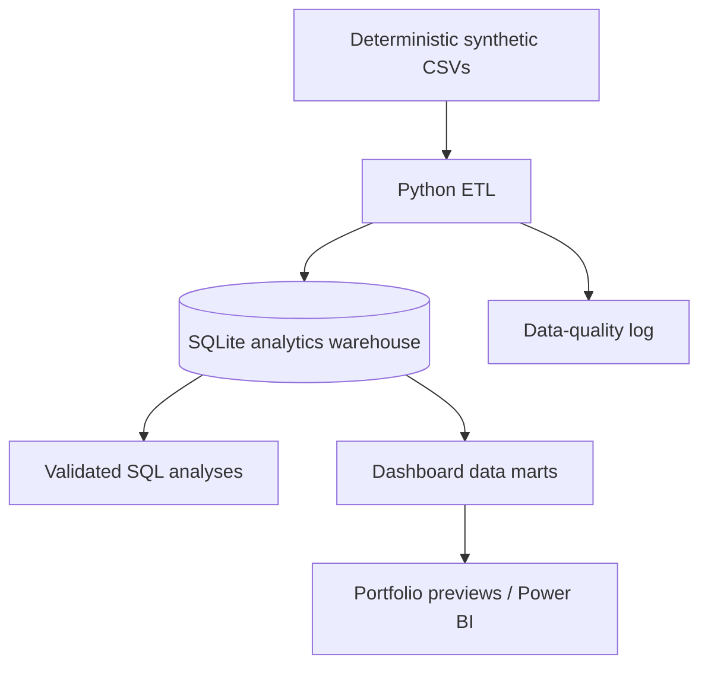

# Healthcare Claims & Payment Integrity Analytics

[](https://github.com/raghuvardhan-mutha/healthcare-claims-analytics/actions/workflows/ci.yml)

An end-to-end healthcare analytics portfolio project that turns deterministic synthetic Medicare-style claims into a normalized SQLite warehouse, validated SQL analyses, dashboard data marts, and reproducible visual outputs.

> **Important:** All patients, providers, claims, and results are synthetic. Payment-integrity signals identify records for review; they do not prove fraud.

## Project highlights

- **40,514 claims** across inpatient, outpatient, and professional/carrier services
- **12-table normalized model** with claim-to-diagnosis and claim-to-procedure bridges
- **30+ SQL analyses** covering claims operations, finance, providers, population health, and payment integrity
- Explainable risk signals for duplicate billing, potential unbundling, and DRG payment outliers
- Automated source-to-target and data-quality validation
- Six reproducible dashboard-ready marts and portfolio previews
- One-command pipeline with automated tests and GitHub Actions

## Dashboard preview

| Executive overview | Claims status |
|---|---|
|  |  |

| Provider performance | Payment integrity |
|---|---|
|  |  |

Additional views: [financial performance](dashboards/03_financial_by_specialty.png) and [population health](dashboards/05_patient_chronic_conditions.png).

## Reproducible sample findings

The seeded dataset produces the following results when run with the fixed random seed:

| Metric | Result | Operational interpretation |
|---|---:|---|
| Total claims | 40,514 | Combined inpatient, outpatient, and carrier volume |
| Total paid amount | $118.5M | Synthetic paid amount across three service years |
| Denial rate | 7.7% | Starting point for denial root-cause analysis |
| Potential unbundled claims | 237 | Outpatient claims with three or more procedure lines |
| Potential duplicate groups | 514 | Same beneficiary, provider, procedure, and service date across multiple claim IDs |
| 30-day readmission signals | 47 | Admissions occurring 0–30 days after a prior discharge |

These indicators would support investigation queues, provider education, prepayment edits, and focused denial-reduction work. They require clinical and coding review before action.

## Architecture



## Data model

The model is inspired by Medicare claims concepts while remaining intentionally smaller than official CMS datasets.

- Members: `beneficiaries`, `chronic_conditions`
- Providers: `providers`
- Claim facts: `inpatient_claims`, `outpatient_claims`, `carrier_claims`
- Pharmacy facts: `prescription_drug_events`
- Code dimensions: `diagnosis_codes`, `procedure_codes`, `drug_codes`
- Bridges: `claim_diagnoses`, `claim_procedures`

See the [data dictionary](docs/data_dictionary.md) and [schema DDL](sql/01_schema.sql).

## Analytics domains

| SQL file | Business questions |
|---|---|
| [Claims operations](sql/02_claims_analytics.sql) | Volume, status mix, denial rates, service duration, aging, and appeals |
| [Financial analytics](sql/03_financial_analytics.sql) | Paid trends, charge-to-paid ratio, high-cost members, and drug spending |
| [Provider analytics](sql/04_provider_analytics.sql) | Peer benchmarks, denial performance, utilization, and cost outliers |
| [Population health](sql/05_patient_analytics.sql) | Prevalence, comorbidity, utilization, geography, and readmission signals |
| [Payment integrity](sql/06_fraud_detection.sql) | Potential unbundling, duplicate billing, DRG outliers, and provider risk ranking |

The composite provider score includes all three documented components: unbundled-claim count, duplicate groups, and cost variance versus specialty peers.

## Run locally

Requires Python 3.11 or newer.

```bash
git clone https://github.com/raghuvardhan-mutha/healthcare-claims-analytics.git
cd healthcare-claims-analytics
python -m venv .venv

# macOS/Linux
source .venv/bin/activate

# Windows PowerShell
# .venv\Scripts\Activate.ps1

pip install -r requirements.txt
python run_pipeline.py
python -m pytest -q
```

The pipeline regenerates the synthetic CSVs, rebuilds the warehouse, runs validation, refreshes all six marts, and recreates the preview images.

## Repository structure

```text
healthcare-claims-analytics/
├── .github/workflows/ci.yml
├── data/                         # generated synthetic CSVs and local DB (git-ignored)
├── dashboards/
│   ├── data_marts/               # reproducible BI-ready outputs
│   └── *.png                     # reproducible portfolio previews
├── docs/
│   ├── data_dictionary.md
│   └── etl_validation_log.md
├── etl/
│   ├── generate_data.py
│   ├── load_data.py
│   └── build_data_marts.py
├── sql/                          # schema plus five analytics domains
├── tests/test_pipeline.py
├── visualizations/generate_dashboard_previews.py
├── requirements.txt
└── run_pipeline.py
```

## Design decisions and limitations

- Synthetic data uses a fixed seed so results are reproducible.
- The local demo uses SQLite. Some analytics queries use SQLite date functions such as `strftime` and `julianday`; PostgreSQL would require dialect-specific date replacements.
- The warehouse loader translates PostgreSQL-oriented `NUMERIC` and `BOOLEAN` types for SQLite.
- Risk rules are transparent portfolio examples, not production fraud models.
- Clinical appropriateness, coding policy, contracts, and medical records are outside this dataset and would be required for a real payment-integrity determination.
- Static images demonstrate the analytical story. A `.pbix` or Tableau workbook can be layered onto the generated marts as a separate BI deliverable.

## Author

**Raghu Vardhan Mutha** — Data Analyst focused on healthcare claims, payment integrity, SQL, data quality, and business intelligence.

## License

Released under the [MIT License](LICENSE).
