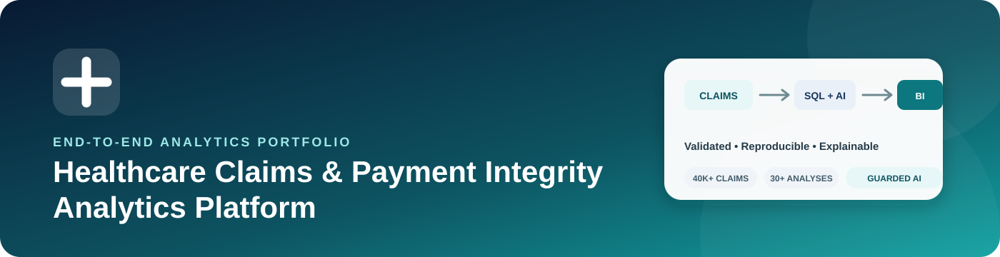
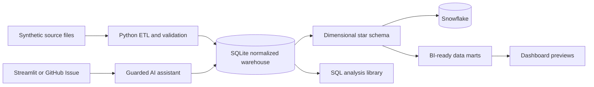
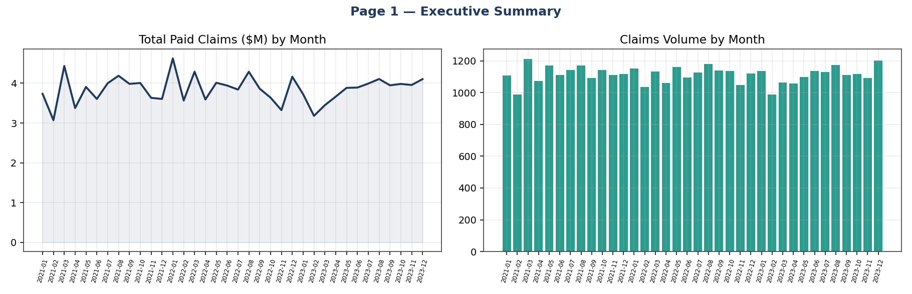
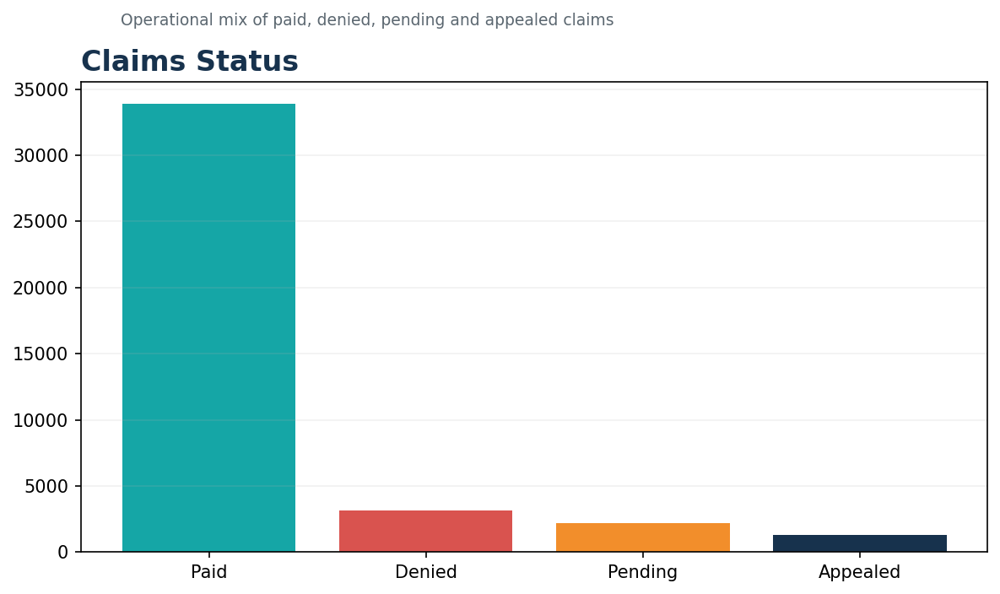
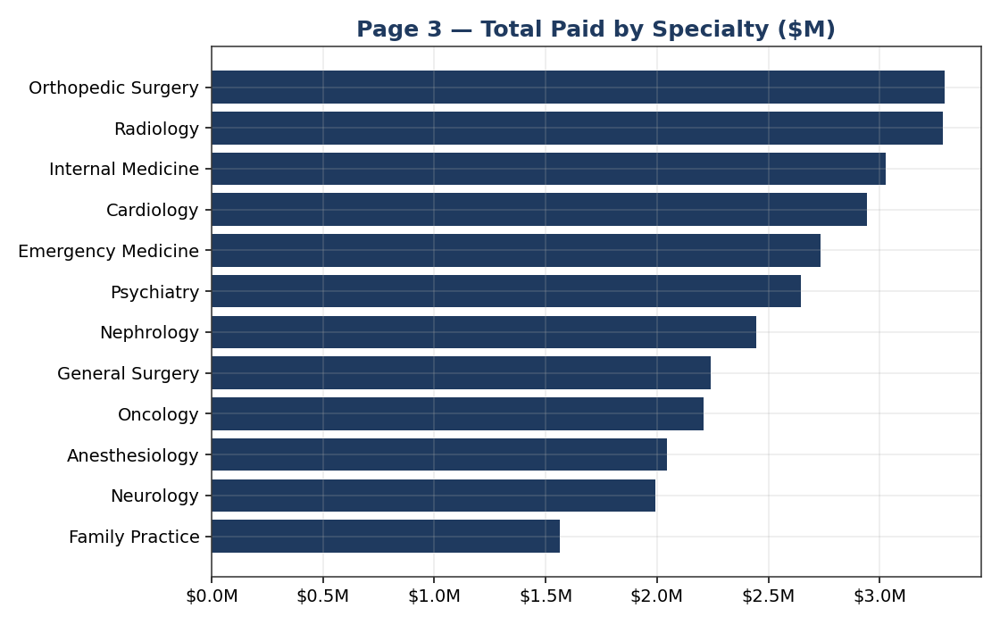
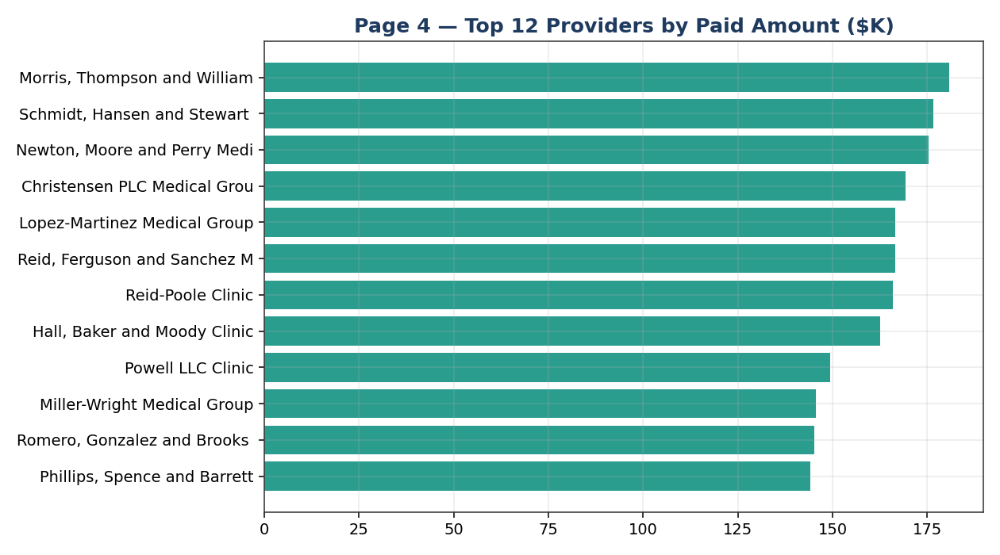
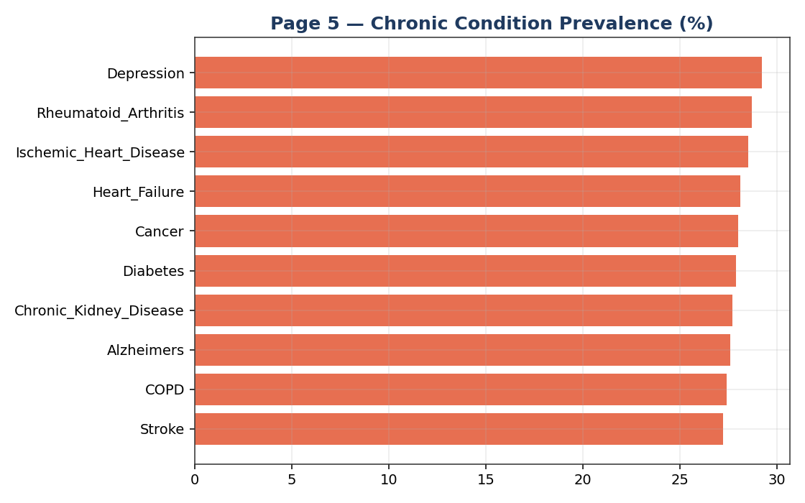
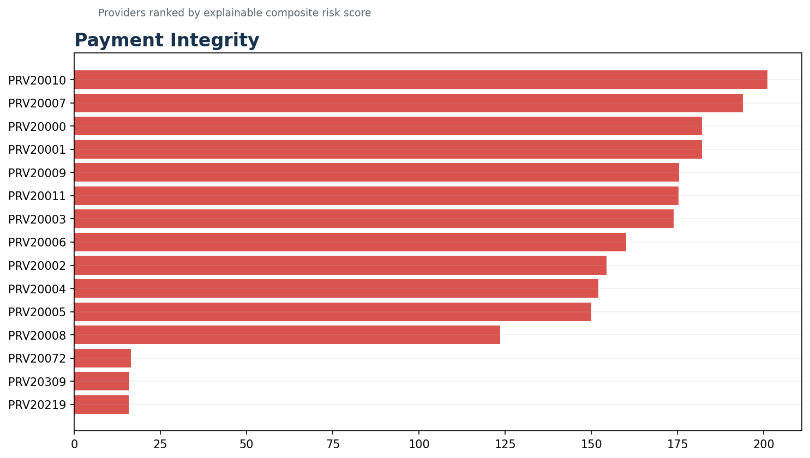

# Healthcare Claims & Payment Integrity Analytics Platform



[](https://github.com/raghuvardhan-mutha/healthcare-claims-analytics/actions/workflows/ci.yml)
[](https://www.python.org/)
[](https://www.sqlite.org/)
[](snowflake/README.md)
[](https://platform.openai.com/docs/)
[](LICENSE)

An end-to-end healthcare analytics portfolio project that converts deterministic synthetic Medicare-style claims into a normalized analytics warehouse, validated SQL insights, BI-ready data marts, reproducible dashboard previews, and a guarded natural-language analytics assistant.

> **Portfolio and educational use only.** Every patient, provider, claim, and result is synthetic. Payment-integrity indicators are review signals—not findings of fraud, clinical conclusions, or reimbursement determinations.

[View dashboards](#dashboard-gallery) · [Run the project](#quick-start) · [Try the AI assistant](#ai-claims-assistant) · [Review the data model](docs/data_dictionary.md) · [Read the project walkthrough](docs/project_walkthrough.md)

## Executive summary

Healthcare claims teams need consistent ways to monitor claim volume, denials, reimbursement, provider performance, utilization, and possible payment-integrity issues. This project demonstrates how an analyst can turn raw claims-style files into decision-ready outputs while preserving reproducibility, data quality, explainability, and responsible AI controls.

The solution supports **operational and financial decision support rather than clinical decision-making**.

| Business need | Project capability | Decision supported |
|---|---|---|
| Fragmented claims data | Python ETL and a normalized 12-table warehouse | Create a consistent analytical foundation |
| Slow recurring analysis | 30+ reusable SQL analyses and six data marts | Monitor KPIs without rebuilding queries |
| Denial and reimbursement visibility | Claims, financial, provider, and population-health views | Prioritize root-cause investigation |
| Payment-integrity review | Explainable duplicate, unbundling, and peer-outlier signals | Build focused review queues |
| Self-service questions | Guarded natural-language-to-SQL assistant | Shorten the path from question to evidence |
| Trust and reproducibility | Fixed seed, validation checks, automated tests, and CI | Recreate and verify every published result |

## Portfolio highlights

- **40,514 synthetic claims** across inpatient, outpatient, and professional/carrier services
- **12-table normalized data model** with diagnosis and procedure bridge tables
- **30+ SQL analyses** across claims operations, finance, providers, population health, and payment integrity
- **Six reproducible BI-ready marts** and matching dashboard previews
- **Working dimensional star schema** with Snowflake deployment and quality-check SQL
- **Power BI Desktop project source** with a Snowflake semantic model, 16 DAX measures, five report pages, theme, and build specification
- **Configurable scale profiles** for approximately 40K, 300K, or 1M base claims
- **Synthetic 837/835 adjudication lifecycle** with billed, allowed, paid, member-responsibility, denial, appeal, and processing-date fields
- **One-command pipeline** that regenerates data, rebuilds the warehouse, validates it, and refreshes outputs
- **AI analytics assistant** available through Streamlit and GitHub Issues
- **Defense-in-depth query security** using a semantic allowlist, SQL AST validation, read-only SQLite, a five-second timeout, and a 200-row limit
- **Automated quality gates** with pytest and GitHub Actions

## Skills demonstrated

| Area | Evidence in this repository |
|---|---|
| Healthcare analytics | Claims status, denials, reimbursement, readmissions, utilization, provider performance, and payment-integrity review signals |
| SQL | CTEs, window functions, aggregation, peer benchmarking, multi-table joins, metric definitions, and data-quality checks |
| Python | Synthetic-data generation, ETL, warehouse loading, validation, data-mart creation, and visualization automation |
| Business intelligence | Power BI Desktop project source, semantic model, DAX KPIs, theme, six subject-area marts, and six executive-ready previews |
| Responsible AI | Structured SQL planning, approved schema/metrics, query validation, safe execution, visible SQL, and synthetic-data disclaimers |
| Engineering quality | Reproducible setup, modular code, tests, CI, environment-based secrets, and technical documentation |

## Solution architecture



### Processing flow

1. `etl/generate_data.py` creates deterministic synthetic claims-style CSV files.
2. `etl/load_data.py` builds the SQLite warehouse and runs source-to-target validation.
3. `etl/build_star_schema.py` creates a Power BI- and Snowflake-aligned dimensional layer.
4. `etl/export_star_schema.py` writes validated Snowflake-ready files.
5. `etl/build_data_marts.py` materializes six analysis-ready CSV marts.
6. `visualizations/generate_dashboard_previews.py` renders reproducible portfolio visuals.
7. `ai/assistant.py` translates approved questions into guarded, read-only SQLite queries.
8. GitHub Actions rebuilds the pipeline and runs all tests on every push and pull request.

## Dashboard gallery

| Executive overview | Claims status |
|---|---|
|  |  |

| Financial performance | Provider performance |
|---|---|
|  |  |

| Population health | Payment-integrity review |
|---|---|
|  |  |

These images are reproducible previews. A source-controlled Power BI Desktop project aligned to the Snowflake model is included in [`powerbi/`](powerbi/); the generated CSV files in `dashboards/data_marts/` also remain available for lightweight BI prototyping.

## Reproducible findings

The fixed random seed produces the same portfolio results on every clean run.

| Metric | Result | Operational interpretation |
|---|---:|---|
| Total claims | 40,514 | Combined inpatient, outpatient, and carrier volume |
| Total paid amount | $118.5M | Synthetic paid amount across three service years |
| Denial rate | 7.7% | Baseline for denial root-cause investigation |
| Potential unbundled claims | 237 | Outpatient claims with three or more procedure lines |
| Potential duplicate groups | 514 | Same beneficiary, provider, procedure, and service date across multiple claim IDs |
| 30-day readmission signals | 47 | Admissions 0–30 days after a prior discharge |

Potential operational actions include focused denial review, provider education, prepayment-edit design, reimbursement monitoring, and prioritized investigation queues. Real-world action would require coding, clinical, contract, policy, and medical-record review.

## Analytics domains

| Domain | Business questions | Source |
|---|---|---|
| Claims operations | What is the volume, status mix, denial rate, service duration, aging, and appeal pattern? | [02_claims_analytics.sql](sql/02_claims_analytics.sql) |
| Financial analytics | How are paid amounts trending? Which members, drugs, and specialties drive cost? | [03_financial_analytics.sql](sql/03_financial_analytics.sql) |
| Provider analytics | How do providers compare with specialty peers on denial, utilization, and reimbursement? | [04_provider_analytics.sql](sql/04_provider_analytics.sql) |
| Population health | What conditions, comorbidities, geographic patterns, and readmission signals appear? | [05_patient_analytics.sql](sql/05_patient_analytics.sql) |
| Payment integrity | Where are potential duplicate, unbundling, DRG, and peer-cost signals concentrated? | [06_fraud_detection.sql](sql/06_fraud_detection.sql) |

The provider risk score combines potential unbundling, potential duplicate groups, and cost variance versus specialty peers. It is an explainable prioritization rule, not a fraud model.

## AI claims assistant

The assistant converts a plain-English analytics question into an approved SQLite query, executes it against the synthetic warehouse, and returns a concise explanation, table, chart when appropriate, and the exact SQL used.

Example questions:

- Which specialties have the highest denial rates?
- Which providers have the strongest payment-integrity review signals?
- Show the monthly paid-amount trend.
- Which chronic conditions are most common?

### Two ways to use it

| Interface | Best for | API key requirement |
|---|---|---|
| Streamlit app | Interactive portfolio demonstrations | Built-in questions work without a key; free-form questions require one |
| GitHub Issues bot | Auditable question-and-answer workflow | Requires `OPENAI_API_KEY` in GitHub Actions secrets |

### AI safety controls

- Only one `SELECT` statement is allowed.
- Tables and columns must exist in the approved semantic layer.
- SQLGlot parses and validates the query before execution.
- SQLite opens in read-only, query-only mode.
- Queries time out after five seconds and return no more than 200 rows.
- Generated SQL is visible to the user.
- OpenAI requests set `store=False`.
- No API key is stored in source control.
- All responses are constrained to synthetic analytical evidence.

See [AI architecture and threat model](docs/ai_architecture.md) for implementation details.

## Quick start

### Prerequisites

- Python 3.11 or newer
- Git
- Optional: an OpenAI API key for free-form AI questions

### 1. Clone and create an environment

```bash
git clone https://github.com/raghuvardhan-mutha/healthcare-claims-analytics.git
cd healthcare-claims-analytics
python -m venv .venv
```

Activate it:

```bash
# macOS/Linux
source .venv/bin/activate

# Windows PowerShell
.venv\Scripts\Activate.ps1
```

### 2. Install dependencies and build everything

```bash
python -m pip install --upgrade pip
pip install -r requirements.txt
python run_pipeline.py
```

The pipeline regenerates the synthetic data, rebuilds the warehouse, executes validation, refreshes six marts, and recreates six dashboard previews.

Choose a larger portfolio benchmark when needed:

```bash
python etl/generate_data.py --scale medium  # approximately 300K base claims
python etl/generate_data.py --scale large   # 1M base claims
```

Then run `python etl/load_data.py`, `python etl/build_star_schema.py`, and `python etl/export_star_schema.py`. The default `demo` profile remains fast enough for CI.

### 3. Run the tests

```bash
python -m pytest -q
```

### 4. Launch the web app

```bash
cp .env.example .env
# Add OPENAI_API_KEY only if you want free-form questions.
streamlit run streamlit_app.py
```

Windows PowerShell users can run `Copy-Item .env.example .env` instead of `cp`.

### 5. Open the Power BI project

After loading the Snowflake star schema, open [`powerbi/HealthcareClaimsAnalytics.pbip`](powerbi/HealthcareClaimsAnalytics.pbip) in Power BI Desktop, configure the Snowflake parameters, refresh, and apply the included theme. See the [Power BI setup guide](powerbi/README.md) and [report build specification](powerbi/report_build_spec.md).

### 6. Configure the GitHub Issues bot

1. Open **Repository Settings → Secrets and variables → Actions**.
2. Add a repository secret named `OPENAI_API_KEY`.
3. Optionally add a repository variable named `OPENAI_MODEL`; the default is `gpt-5.6`.
4. Open **Issues → New issue → Ask the claims AI**.

The OpenAI API is billed separately from ChatGPT subscriptions. Never paste API keys, PHI, real patient data, or confidential company information into code, issues, logs, or screenshots.

## Data model

The intentionally compact model is inspired by Medicare claims concepts:

- Members: `beneficiaries`, `chronic_conditions`
- Providers: `providers`
- Claim facts: `inpatient_claims`, `outpatient_claims`, `carrier_claims`
- Pharmacy facts: `prescription_drug_events`
- Code dimensions: `diagnosis_codes`, `procedure_codes`, `drug_codes`
- Bridges: `claim_diagnoses`, `claim_procedures`

See the complete [data dictionary](docs/data_dictionary.md) and [schema DDL](sql/01_schema.sql).

## Repository structure

```text
healthcare-claims-analytics/
├── ai/                         # Assistant, semantic layer, database access, and SQL guard
├── assets/                     # README visual assets
├── dashboards/                # Six previews and generated BI-ready marts
├── data/                      # Generated synthetic data and local DB (git-ignored)
├── docs/                      # Architecture, dictionary, walkthrough, and validation evidence
├── etl/                       # Data generation, warehouse loading, and mart creation
├── powerbi/                   # PBIP source, Snowflake semantic model, DAX, theme, and report spec
├── scripts/                   # GitHub Issues bot
├── snowflake/                 # Setup, star-schema DDL, COPY INTO, and quality checks
├── sql/                       # Schema and five analytics domains
├── tests/                     # Pipeline, AI assistant, and guardrail tests
├── visualizations/            # Reproducible chart generation
├── streamlit_app.py           # Interactive AI analytics UI
├── run_pipeline.py            # One-command project build
└── requirements.txt           # Reproducible Python dependencies
```

## Quality and governance

- The data generator uses a fixed seed for repeatable results.
- Validation covers record counts, required fields, key relationships, and business-rule checks.
- Adjudication checks enforce date chronology and `paid ≤ allowed ≤ billed` reconciliation.
- Ground-truth synthetic labels identify deliberately injected review signals for later evaluation.
- Tests cover the pipeline, AI behavior, and SQL guardrails.
- CI runs a clean warehouse rebuild and the test suite on pushes and pull requests.
- Secrets are loaded only from local environment variables or GitHub Actions secrets.
- Real PHI is outside the scope of this repository.

## Current scope and roadmap

### Complete

- [x] Reproducible synthetic claims pipeline
- [x] Normalized SQLite warehouse
- [x] Dimensional star schema and Snowflake deployment scripts
- [x] Configurable 40K/300K/1M generation profiles
- [x] Synthetic 837/835 adjudication lifecycle and integrity labels
- [x] SQL analytics library
- [x] Six BI-ready marts and dashboard previews
- [x] Power BI Desktop project source, Snowflake semantic model, DAX KPI layer, theme, and five-page report scaffold
- [x] Streamlit AI assistant
- [x] GitHub Issues AI bot
- [x] SQL guardrails, automated tests, and CI
- [x] Data dictionary and architecture documentation
- [x] Business requirements, KPI catalog, UAT plan, Docker, and deployment guide

### Future extensions

- [ ] Publish a hosted Streamlit demonstration
- [ ] Publish the Power BI project to a governed Fabric workspace
- [ ] Add precision, recall, and F1 evaluation for the labeled anomaly patterns
- [ ] Add production-grade authentication, audit logging, rate limiting, and monitoring

## Limitations

- This is synthetic portfolio data, not CMS source data and not production healthcare data.
- SQLite is the supported zero-configuration local dialect; the `snowflake/` folder provides a separate enterprise deployment path.
- Payment-integrity rules are transparent examples and may produce false positives.
- The assistant is not a medical, coding, reimbursement, or fraud-determination system.
- A real investigation would require policy, contract, coding, clinical, and medical-record evidence not present here.
- The Power BI source is statically validated in CI; a credentialed Snowflake refresh and final visual-layout review require Power BI Desktop on Windows.

## Documentation

- [Project walkthrough](docs/project_walkthrough.md)
- [AI architecture and threat model](docs/ai_architecture.md)
- [Data dictionary](docs/data_dictionary.md)
- [ETL validation evidence](docs/etl_validation_log.md)
- [Business requirements](docs/business_requirements.md)
- [KPI catalog](docs/kpi_catalog.md)
- [UAT test plan](docs/uat_test_plan.md)
- [Deployment guide](docs/deployment.md)
- [Power BI setup](powerbi/README.md)
- [Contributing guide](CONTRIBUTING.md)
- [Security policy](SECURITY.md)

## Author

**Raghu Vardhan Mutha**  
Data Analyst focused on healthcare claims, payment integrity, SQL, data quality, business intelligence, and responsible AI-assisted analytics.

## License

Released under the [MIT License](LICENSE).
