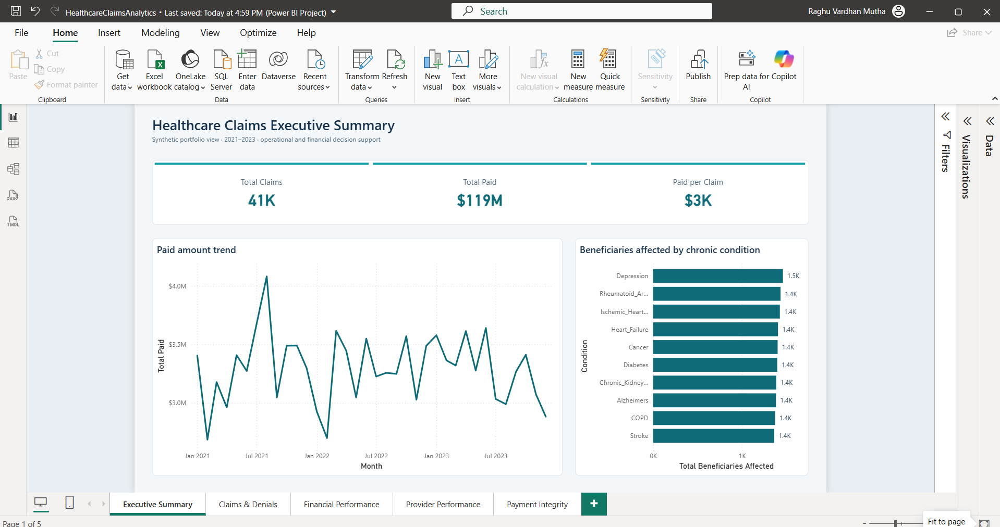
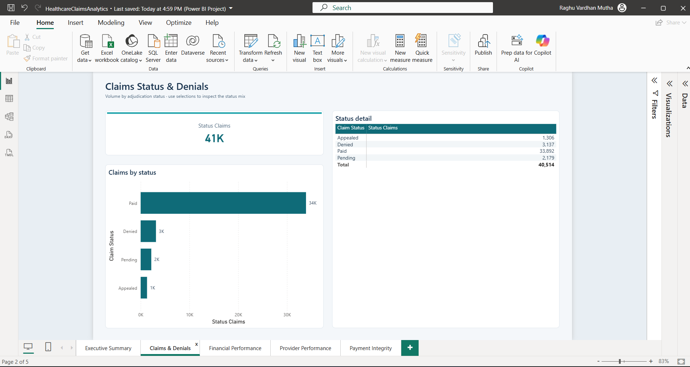
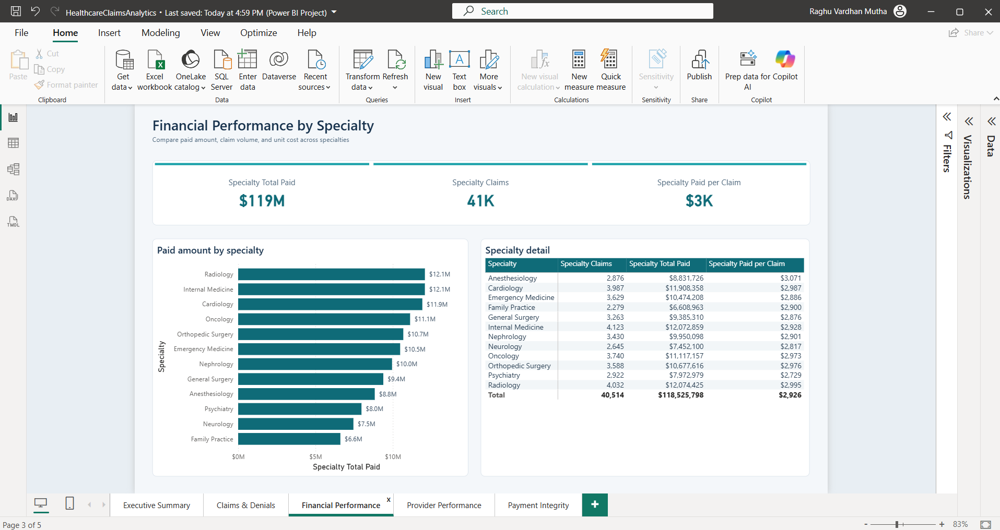
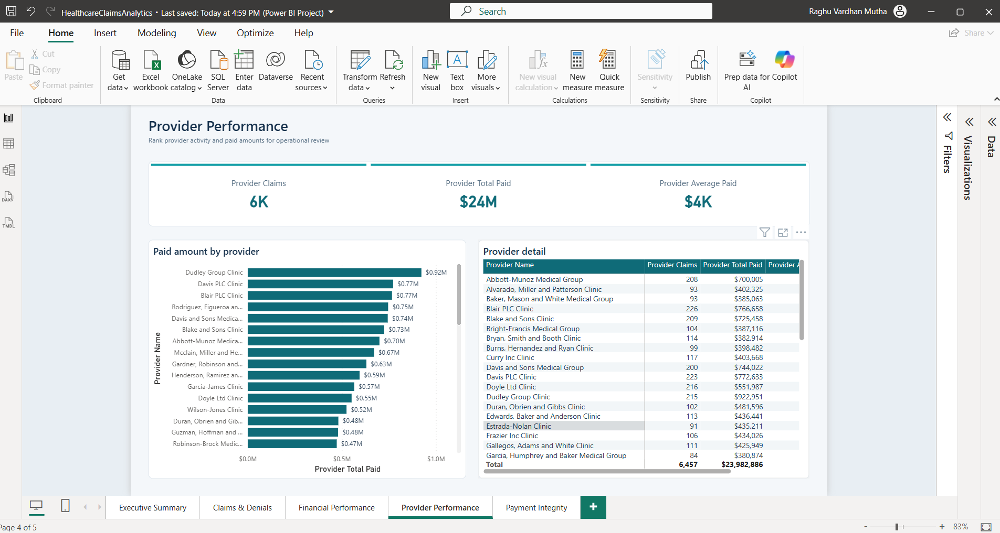
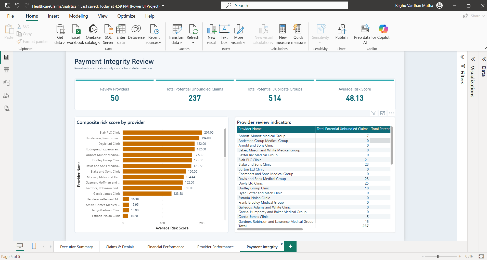
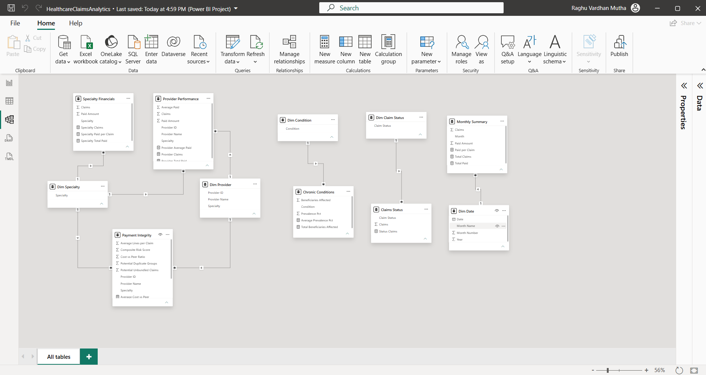
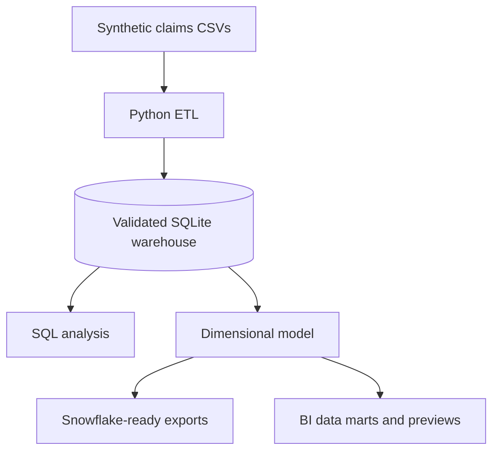

# Healthcare Claims Analytics

[](https://github.com/raghuvardhan-mutha/healthcare-claims-analytics/actions/workflows/ci.yml)
[](https://www.python.org/)
[](snowflake/README.md)


I built this project to practice the type of analysis a healthcare claims team performs every day: monitoring denials, reconciling payments, comparing providers, and identifying claims that may need additional review. The project starts with synthetic claims files and produces a validated warehouse, reusable SQL analysis, dashboard-ready datasets, and reproducible report previews.

**Dataset:** 40,514 claims · 5,000 beneficiaries · 400 providers · 14 normalized tables · 2021–2023

> All names, claims, and results are synthetic. The payment-integrity rules identify records for review; they do not establish fraud or support clinical decisions.

## What I wanted to answer

- How are claim volume, paid amount, and denial rate changing over time?
- Which specialties and providers have unusually high denial or payment patterns?
- Do billed, allowed, and paid amounts reconcile correctly?
- Where do duplicate, procedure-line, or readmission patterns warrant review?
- Can the same results be regenerated and checked automatically?

## Power BI Desktop report

The PBIP project opens as a five-page interactive report backed by a documented semantic model. The screenshots below show every refreshed report page and the one-to-many model relationships in Power BI Desktop.



| Claims and denials | Financial performance |
|---|---|
|  |  |

| Provider performance | Payment-integrity review |
|---|---|
|  |  |



## Reproducible dashboard previews

| Executive summary | Claims and denials |
|---|---|
|  |  |

| Financial performance | Provider performance |
|---|---|
|  |  |

| Chronic conditions | Payment-integrity review |
|---|---|
|  |  |

The charts above are generated from the same data marts used by the BI layer. The `powerbi/` folder contains the version-controlled 11-table semantic model, eight relationships, DAX measures, five populated report pages, theme, and a visual build specification for Power BI Desktop.

## What the project includes

| Component | Implementation |
|---|---|
| Data generation | Deterministic Python generator with demo, medium, and large scale profiles |
| Local warehouse | SQLite implementation with 14 normalized claims tables |
| Analytics model | Date, member, provider, and claim dimensions/facts plus bridge exports |
| SQL analysis | 30+ queries covering operations, finance, providers, members, and payment integrity |
| BI outputs | Six CSV data marts, six generated previews, and Power BI project source |
| Snowflake path | Star-schema DDL, staged-load SQL, exports, and data-quality checks |
| Validation | Source-to-target counts, key checks, financial rules, pytest, and GitHub Actions |
| Optional assistant | Four no-key example questions plus guarded free-form queries when an API key is configured |

## How the data flows



The local pipeline is the reproducible reference implementation. Snowflake scripts and the Power BI semantic model show how I would move the same measures into an enterprise BI environment without changing their definitions.

## Reproducible results

The generator uses a fixed seed, so a clean run produces the same benchmark results.

| Metric | Demo result |
|---|---:|
| Total claims | 40,514 |
| Total paid amount | $118.5M |
| Denial rate | 7.7% |
| Potential procedure-line review signals | 237 |
| Potential duplicate groups | 514 |
| 30-day readmission signals | 47 |

These values describe the synthetic demo data only. In a real claims environment, every flagged pattern would require validation against coding rules, contracts, policies, and supporting records.

## Data model

The normalized layer separates members, providers, code reference data, claims, claim lines, and adjudication events:

- Members: `beneficiaries`, `chronic_conditions`
- Providers: `providers`
- Claims: `inpatient_claims`, `outpatient_claims`, `carrier_claims`
- Pharmacy: `prescription_drug_events`
- Reference data: `diagnosis_codes`, `procedure_codes`, `drug_codes`
- Claim detail: `claim_diagnoses`, `claim_procedures`, `claim_adjudication`
- Validation labels: `claim_integrity_labels`

The dimensional layer reorganizes this data for Snowflake and Power BI. See the [data dictionary](docs/data_dictionary.md) and [Snowflake design](docs/snowflake_architecture.md).

## Run it locally

### Requirements

- Python 3.11 or newer
- Git

### Setup

```bash
git clone https://github.com/raghuvardhan-mutha/healthcare-claims-analytics.git
cd healthcare-claims-analytics
python -m venv .venv
```

Activate the environment:

```bash
# Windows PowerShell
.venv\Scripts\Activate.ps1

# macOS or Linux
source .venv/bin/activate
```

Install and run:

```bash
python -m pip install --upgrade pip
pip install -r requirements.txt
python run_pipeline.py
python -m pytest -q
```

`run_pipeline.py` regenerates the data, rebuilds the warehouse, validates it, exports the dimensional model, refreshes the data marts, and recreates the dashboard images.

## Snowflake and Power BI

The two review paths are intentionally separate:

- **Power BI demo:** Open [`powerbi/HealthcareClaimsAnalytics.pbip`](powerbi/HealthcareClaimsAnalytics.pbip) in Power BI Desktop. It loads the six public synthetic data marts from this repository and does not require a Snowflake account. If prompted for the public GitHub data source, select **Anonymous** and **Public**.
- **Snowflake deployment:** Follow [`snowflake/README.md`](snowflake/README.md) to create and load the dimensional model, then run `snowflake/03_quality_checks.sql`.

The repository validates the Power BI JSON and model structure in CI. Final visual rendering is reviewed in Power BI Desktop because Desktop is unavailable on the Linux CI runner.

## Optional analytics assistant

The Streamlit interface is an additional demonstration, not a dependency of the ETL or dashboards.

```bash
streamlit run streamlit_app.py
```

These built-in questions work without an API key:

- `Which specialties have the highest denial rates?`
- `Which providers have the strongest payment-integrity signals?`
- `Show the monthly paid-amount trend.`
- `Which chronic conditions are most common?`

Free-form questions require `OPENAI_API_KEY`. Generated SQL is restricted to one read-only `SELECT`, validated against approved tables and columns, limited to 200 rows, and shown with the answer. See the [assistant design notes](docs/ai_architecture.md).

## Validation and testing

The automated checks cover:

- Source CSV and warehouse row-count reconciliation
- Required table and dimensional-model structure
- Orphaned keys and invalid claim statuses
- Date chronology and nonnegative amounts
- The rule `paid amount ≤ allowed amount ≤ billed amount`
- Read-only SQL enforcement and approved-schema checks
- GitHub issue-template question parsing
- Power BI project JSON, pages, measures, and relationships

The latest verified local run completed the pipeline twice consecutively and passed all 22 tests. GitHub Actions independently rebuilds the demo and runs the suite on every push and pull request.

## Repository guide

```text
ai/                Optional analytics assistant and SQL validation
dashboards/        Generated report previews and BI data marts
docs/              Requirements, data dictionary, KPI definitions, and UAT plan
etl/               Data generation, loading, validation, and exports
powerbi/           Power BI project source and report build specification
snowflake/         Snowflake DDL, load scripts, and quality checks
sql/               Schema and reusable analysis queries
tests/             Pipeline, data-quality, assistant, and asset tests
visualizations/    Reproducible dashboard rendering
run_pipeline.py    One-command local build
```

## Scope and limitations

- The data is synthetic and does not reproduce a specific payer's policies or contracts.
- SQLite is the fully tested local warehouse; Snowflake is the documented deployment path.
- The checked-in Power BI demo uses aggregated public marts; claim-level drill-through remains part of the optional Snowflake deployment path.
- Review signals are transparent rules, not a trained fraud model.
- Real healthcare deployment would require PHI controls, access management, audit logging, monitoring, and organizational approval.

## Documentation

- [Project walkthrough](docs/project_walkthrough.md)
- [Business requirements](docs/business_requirements.md)
- [Data dictionary](docs/data_dictionary.md)
- [KPI catalog](docs/kpi_catalog.md)
- [ETL validation log](docs/etl_validation_log.md)
- [UAT plan](docs/uat_test_plan.md)
- [Deployment guide](docs/deployment.md)

## Author

**Raghu Vardhan Mutha**  
Data Analyst | Healthcare Claims | SQL | Snowflake | Power BI

## License

Released under the [MIT License](LICENSE).
