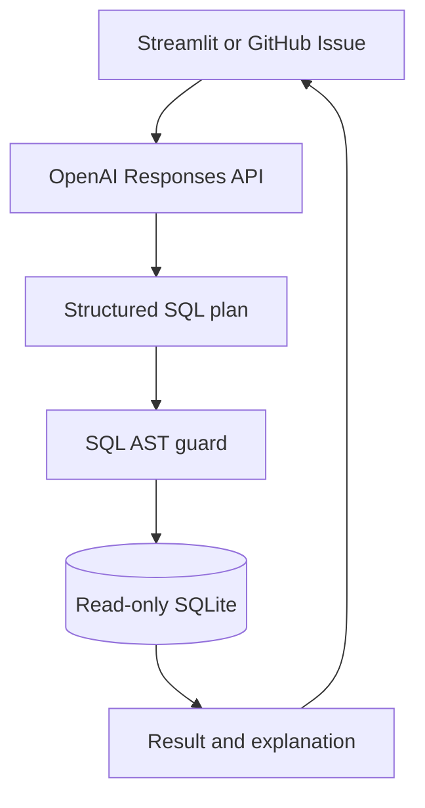

# AI Claims Assistant Architecture

The AI layer is a constrained analytics interface over the repository's synthetic SQLite warehouse. It is available through the Streamlit app and through `[AI Question]` GitHub Issues.

## Guardrails

- The model receives an approved semantic layer, not unrestricted database access.
- Structured Outputs constrain the planning response to SQL and chart metadata.
- SQLGlot parses the statement and blocks non-SELECT operations, multiple statements, and unknown tables or columns.
- SQLite is opened with `mode=ro` and `PRAGMA query_only = ON`.
- Every result is capped at 200 rows and interrupted after five seconds.
- API calls set `store=False`.
- API keys are loaded from environment variables or GitHub Actions secrets and are ignored by Git.
- All user-facing surfaces state that the records are synthetic and payment-integrity patterns are review signals, not confirmed fraud.

## Threat model

Issue text and Streamlit questions are untrusted input. The LLM cannot write to the database, modify the repository, call arbitrary tools, or choose tables outside the semantic layer. The GitHub workflow has only `contents: read` and `issues: write` permissions.

This is a portfolio-grade reference architecture. A production healthcare deployment would additionally require identity and access management, PHI controls, audit logging, model-risk review, rate limiting, monitoring, and organization-approved data-processing agreements.
