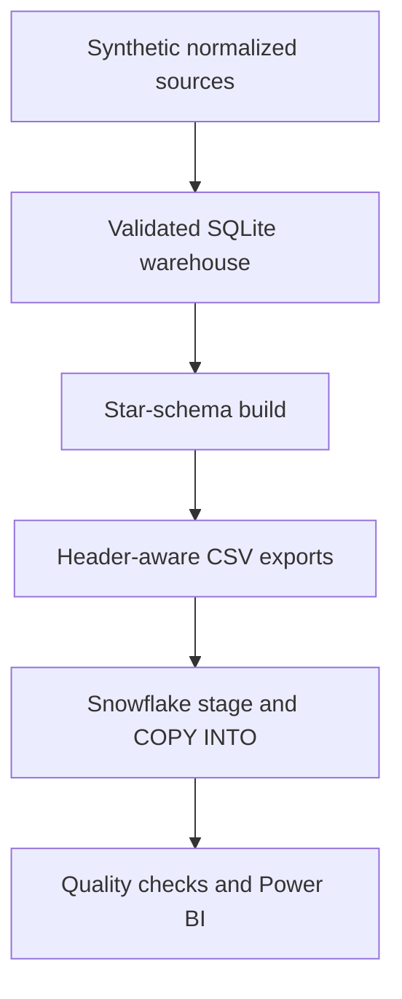

# Snowflake Architecture

The enterprise path preserves the zero-configuration SQLite demo while adding a dimensional layer designed for Snowflake and Power BI.

## Grain and relationships

- `FACT_CLAIM`: one row per claim and claim type
- `DIM_DATE`: one row per service date
- `DIM_MEMBER`: one row per synthetic beneficiary
- `DIM_PROVIDER`: one row per synthetic provider
- `BRIDGE_CLAIM_DIAGNOSIS`: one row per claim-diagnosis sequence
- `FACT_CLAIM_PROCEDURE`: one row per claim-procedure sequence

The model separates high-use dimensions from the claim fact, supports one-to-many Power BI relationships, and retains the normalized warehouse for detailed lineage.

## Cost and governance

- The example warehouse uses `XSMALL`, auto-resume, and 60-second auto-suspend.
- Generated exports and credentials remain outside source control.
- Snowflake standard-table key constraints document intent but are not enforced; `03_quality_checks.sql` verifies uniqueness, financial ordering, date chronology, and orphan keys.
- All records remain synthetic and unsuitable for clinical, reimbursement, or fraud determinations.
