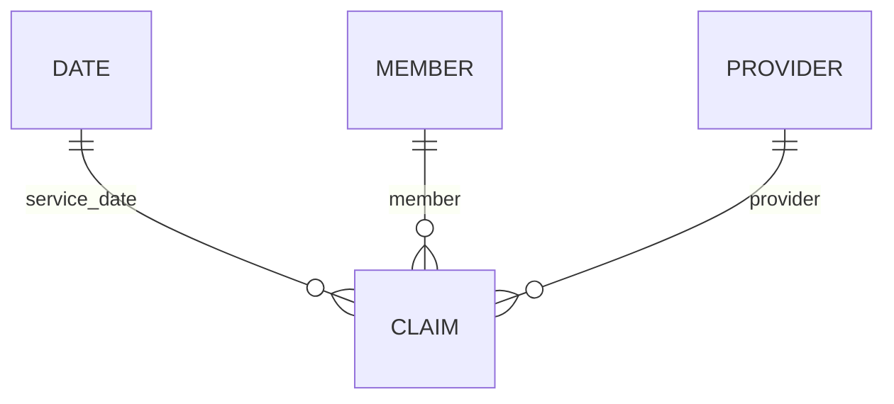

# Power BI Desktop project

This folder contains a source-control-friendly Power BI Project (`.pbip`) aligned to the Snowflake star schema. It includes a four-table semantic model, 16 DAX measures, three relationships, parameterized Snowflake Power Query expressions, five named report pages, a professional theme, and a visual build specification.

## Open and connect

1. Run the Snowflake setup and load scripts in [`../snowflake/README.md`](../snowflake/README.md).
2. In current Power BI Desktop on Windows, enable **Power BI Project (.pbip) save option** under **File → Options and settings → Options → Preview features** if your version still requires it.
3. Open `HealthcareClaimsAnalytics.pbip`.
4. In **Transform data → Manage parameters**, replace `SnowflakeServer` and `SnowflakeWarehouse`; keep the default database and schema unless you changed them.
5. Select **Apply changes**, authenticate to Snowflake, then refresh.
6. Import `healthcare_claims_theme.json` from **View → Themes → Browse for themes**.
7. Build or refine visuals using `report_build_spec.md`, then save as `.pbip` for source control or `.pbix` for distribution.

The repository validates the PBIR structure and all JSON files in CI. A final refresh and visual-render check must be performed in Power BI Desktop because the Linux CI runner cannot host Power BI Desktop or Snowflake credentials.

## Model

The model uses Import mode for responsive exploration. For production-sized workloads, apply incremental refresh and role-level security after confirming the organization’s retention and access policies.
